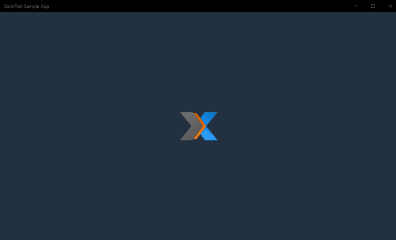
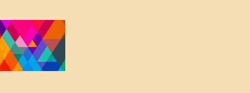
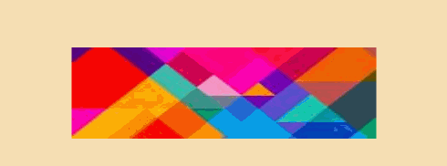
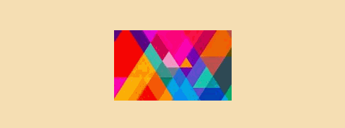
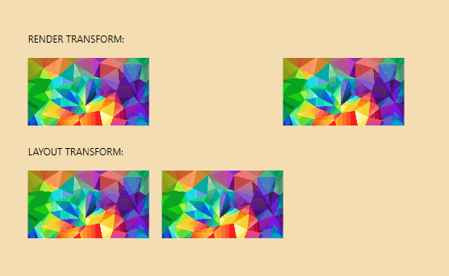

# XamlFlair

The goal of the XamlFlair library is to ease the implementation of common animations and allow a developer to *easily* add a single or combined set of animations with just a few lines of Xaml.



## Contents

- [Install from Nuget](#install-from-nuget)

- [Features Overview](#features-overview)

- [Basic Concepts](#basic-concepts)

- [Usage](#usage)

- [Base Animation Types](#base-animation-types)

- [Using a `ResourceDictionary` for Base Settings](#using-a-resourcedictionary-for-base-settings)

- [Default Animations (*UWP And WPF Only*)](#default-animations-uwp-and-wpf-only)

- [`TransformOn` Property (*WPF Only*)](#transformon-property-wpf-only)

- [Combining Animations](#combining-animations)

- [Overriding Values](#overriding-values)

- [Relative Translations on X and Y Axes](#relative-translations-on-x-and-y-axes)

- [Compound Animations](#compound-animations)

- [Repeating Animations](#repeating-animations)

- [Events and Bindings](#events-and-bindings)

- [Primary and Secondary Completion Commands](#primary-and-secondary-completion-commands)

- [Using the `StartWith` Property](#using-the-startwith-property)

- [Using the `AllowOpacityReset` Property (*WPF Only*)](#using-the-allowopacityreset-property-wpf-only)

- [Using the `ClipToBounds` Property (*UWP And Uno Only*)](#using-the-cliptobounds-property-uwp-and-uno-only)

- [Logging Animations](#logging-animations)

- [`ListViewBase` (_UWP and Uno_) and `ListBox`-based (_WPF_) Animations](#listviewbase-uwp-and-uno-and-listbox-based-wpf-animations)

## Install from Nuget

| Platform | Package | NuGet |
| -------- | -------- | ------- |
| UWP | [XamlFlair.UWP][UWPNuGet] | [![UWPNuGetShield]][UWPNuGet] |
| WPF | [XamlFlair.WPF][WPFNuGet] | [![WPFNuGetShield]][WPFNuGet] |
| Uno | [XamlFlair.Uno][UNONuGet] | [![UNONuGetShield]][UNONuGet] |

To install **XamlFlair**, run the following command in the **Package Manager Console**:

UWP:

```
Install-Package XamlFlair.UWP
```

> Your app must target a minimum of Windows 10 version 1809 (build 17763)

WPF:

```
Install-Package XamlFlair.WPF
```

Uno:

```
Install-Package XamlFlair.Uno
```

> Your UWP app must target a minimum of Windows 10 version 1809 (build 17763)

## Features Overview

Feature                               | **UWP**     | **WPF**     | **UWP (Uno)** | **iOS (Uno)** | **Android (Uno)** | **Wasm (Uno) EXPERIMENTAL **
------------------------------------- | ----------- | ----------- | ------------- | ------------- | ----------------- | ----------------------------
*Animation System*                    | Composition | Storyboards | Storyboards   | Storyboards   | Storyboards       |         Storyboards
Composite Transforms                  |      X      |     X       |       X       |       X       |         X         |              X
DefaultAnimations.xaml                |      X      |     X       |       -       |       -       |         -         |              -
`TransformOn`                         |      -      |     X       |       -       |       -       |         -         |              -
Compound Animations                   |      X      |     X       |       X       |       X       |         X         |              X
Relative Translations                 |      X      |     X       |       X       |       X       |         X         |              X
Repeating Animations                  |      X      |     X       |       X       |       X       |         X         |              X
Events & Bindings                     |      X      |     X       |       X       |       X       |         X         |              X
Primary/Secondary Completion Commands |      X      |     X       |       X       |       X       |         X         |              X
`StartWith`                           |      X      |     X       |       X       |       X       |         X         |              X
`AllowOpacityReset`                   |      -      |     X       |       -       |       -       |         -         |              -
`ClipToBounds`                        |      X      |    N/A      |       X       |       X       |         X         |              X
Animated Lists                        |      X      |     X       |       X       |       X       |         X         |              X
Blur Effect                           |      X      |     X       |       -       |       -       |         -         |              -
Saturation Effect                     |      X      |     -       |       -       |       -       |         -         |              -
Tint Effect                           |      X      |     -       |       -       |       -       |         -         |              -

> **Note**: A standard UWP app and a Uno app (UWP head) are different when it comes to XamlFlair. A standard UWP app referencing `XamlFlair.UWP` will use Composition-based animations behind the scenes. An Uno app (including the UWP head) that references `XamlFlair.Uno` will all use Storyboarding behind the scenes.

## Basic Concepts

The basic concept of XamlFlair is based on animations that are categorized as _From_ and _To_. Any UI element that consists of a _From_ animation will **start with one or more arbitrary values, and complete using the default value of the corresponding property**. Any UI element that consists of a _To_ animation will **start in its current state and animate to one or more arbitrary values**.

Example of a _From_ animation (a UI element translating to the default value of a Translation (0)):



Example of a _To_ animation (a UI element sliding away from its current state):


## Usage

To begin, you need to have the following Xaml namespace reference:

UWP and Uno:
```xml
xmlns:xf="using:XamlFlair"
```

WPF:
```xml
xmlns:xf="clr-namespace:XamlFlair;assembly=XamlFlair.WPF"
```

From here on, it's a simple matter of setting an attached property to any `FrameworkElement` that needs an animation:

```xml
<Border xf:Animations.Primary="{StaticResource FadeIn}" />
```

> **Note**: If your `FrameworkElement` defines a `CompositeTransform` in your Xaml, it will be altered during the animation process.

> **Note**: The use of `StaticResource` is to reference global common animations, which is discussed in the next section.

### Base Animation Types

#### Fade


> **Warning**: Be careful when animating `FadeTo` since the element remains in the Visual Tree if the `Visibility` is `Visible`. There may be cases where you'll need to manually manage `IsHitTestVisible` to allow the user to tap *through* the element.

#### Translate


#### Scale



#### Rotate



#### Blur (_UWP and WPF only_)


#### Saturate (_UWP only_)


#### Tint (_UWP only_)


The following lists some notable **default values** when working with XamlFlair:

* **Kind**: FadeTo
* **Duration**: 500
* **Easing**: Cubic
* **Easing Mode**: EaseOut
* **TransformCenterPoint**: (0.5, 0.5)
* **Event**: Loaded
* **Saturation**: 0.5 (_UWP only_)
* **Tint**: Transparent (_UWP only_)

### Using a `ResourceDictionary` for Base Settings

All **common** animations should be placed in a global `ResourceDictionary` (ex: `Animations.xaml`) and used where needed throughout the app. The goal is to consolidate all the animations into one file with meaningful names so that any developer can understand exactly what animation is applied to a `FrameworkElement`. Here's a small example of what it looks like:

```xml
<ResourceDictionary xmlns="http://schemas.microsoft.com/winfx/2006/xaml/presentation"
                    xmlns:x="http://schemas.microsoft.com/winfx/2006/xaml"
                    xmlns:xf="using:XamlFlair">

    <x:Double x:Key="PositiveOffset">50</x:Double>
    <x:Double x:Key="NegativeOffset">-50</x:Double>
    <x:Double x:Key="SmallScaleFactor">0.75</x:Double>
    <x:Double x:Key="LargeScaleFactor">1.25</x:Double>

    <xf:AnimationSettings x:Key="FadeIn"
                          Kind="FadeFrom"
                          Opacity="0" />

    <xf:AnimationSettings x:Key="FadeOut"
                          Kind="FadeTo"
                          Opacity="0" />

    <!-- Scale to a larger value -->
    <xf:AnimationSettings x:Key="Expand"
                          Kind="ScaleXTo,ScaleYTo"
                          ScaleX="{StaticResource LargeScaleFactor}"
                          ScaleY="{StaticResource LargeScaleFactor}" />

    <!-- Scale from a larger value -->
    <xf:AnimationSettings x:Key="Contract"
                          Kind="ScaleXFrom,ScaleYFrom"
                          ScaleX="{StaticResource LargeScaleFactor}"
                          ScaleY="{StaticResource LargeScaleFactor}" />
    .
    .
    .
    </ResourceDictionary>
```

To setup this set of pre-configured `AnimationSettings` already available in your app, perform the following steps:

1. Right-click on your project, then click **Add > New Item...**
2. Choose **Resource Dictionary** and name it `Animations.xaml`
3. In your `App.xaml`, add the following:

```xml
    <Application.Resources>
        <ResourceDictionary>
            <ResourceDictionary.MergedDictionaries>
                <ResourceDictionary Source="Animations.xaml" />
            </ResourceDictionary.MergedDictionaries>
        </ResourceDictionary>
    </Application.Resources>
```

4. In `Animations.xaml`, copy & paste the contents from the corresponding links below:

- [Animation settings for UWP](https://github.com/XamlFlair/XamlFlair/blob/master/Samples/XamlFlair.Samples.UWP/Animations.xaml)

- [Animation settings for WPF](https://github.com/XamlFlair/XamlFlair/blob/master/Samples/XamlFlair.Samples.WPF/Animations.xaml)

- [Animation settings for Uno](https://github.com/XamlFlair/XamlFlair/blob/master/Samples/Uno/XamlFlair.Samples.Uno.Shared/Animations.xaml)

Your app now has a global set of **common** animations ready to use.

### Default Animations (*UWP And WPF Only*)

Alternatively to creating your own `ResourceDictionary` containing your custom  `AnimationSettings`, XamlFlair provides some **Default** Animations.

To reference these Default Animations in your app, perform the following steps:

1. In your `App.xaml`, add the following

```xml
    <Application.Resources>
        <ResourceDictionary>
            <ResourceDictionary.MergedDictionaries>
                <ResourceDictionary Source="pack://application:,,,/XamlFlair.WPF;component/DefaultAnimations.xaml"/>
            </ResourceDictionary.MergedDictionaries>
        </ResourceDictionary>
    </Application.Resources>
```

Where you should replace the merged dictionary URI accordling,

```xml
<!-- WPF -->
<ResourceDictionary Source="pack://application:,,,/XamlFlair.UWP;component/DefaultAnimations.xaml"/>

<!-- UWP -->
<ResourceDictionary Source="ms-appx:///XamlFlair.UWP/DefaultAnimations.xaml" />
```

Your app now has a global set of **Default** animations ready to use as such:

```xml
<Border xf:Animations.Primary="{xf:Animate BasedOn={StaticResource FadeInAndSlideFromBottom}"/>
```

### `TransformOn` Property (*WPF Only*)

Using the `TransformOn` property, you can target which type of `RenderTransform` to apply to your animation. Available options are `Render` and `Layout`. When nothing is specified, the default vale is `Render`. Here's an example of the two:



### Combining Animations

Animations can be combined, and as previously mentioned, any of these *combined* animations that are commonly used should be placed in the global `ResourceDictionary` (ex: `Animations.xaml`):

```xml
<ResourceDictionary xmlns="http://schemas.microsoft.com/winfx/2006/xaml/presentation"
                    xmlns:x="http://schemas.microsoft.com/winfx/2006/xaml"
                    xmlns:xf="using:XamlFlair">
    .
    .
    .
    <xf:AnimationSettings x:Key="FadeInAndSlideFromLeft"
                          Kind="FadeFrom,TranslateXFrom"
                          Opacity="0"
                          OffsetX="{StaticResource NegativeOffset}" />

    <xf:AnimationSettings x:Key="FadeInAndSlideFromTop"
                          Kind="FadeFrom,TranslateYFrom"
                          Opacity="0"
                          OffsetY="{StaticResource NegativeOffset}" />

    <xf:AnimationSettings x:Key="FadeInAndGrow"
                          Kind="FadeFrom,ScaleXFrom,ScaleXFrom"
                          Opacity="0"
                          ScaleX="{StaticResource SmallScaleFactor}"
                          ScaleY="{StaticResource SmallScaleFactor}" />

    <xf:AnimationSettings x:Key="FadeInAndGrowHorizontally"
                          Kind="FadeFrom,ScaleXFrom"
                          Opacity="0"
                          ScaleX="{StaticResource SmallScaleFactor}" />
    .
    .
    .
    </ResourceDictionary>
```

This demonstrates a combined animation of a `FadeFrom` and `TranslateFrom`:


This demonstrates a combined animation of a `FadeFrom`, `TranslateFrom`, and `ScaleFrom`:


### Overriding Values

Animations can have their settings overridden directly on the `FrameworkElement`. This is commonly done to alter values for Delay and Duration so that we don't over-populate the `Animations.xaml` file with repeated resources. To achieve overriding, use the `Animate` markup extension paired with the `BasedOn` property:

```xml
<Border xf:Animations.Primary="{xf:Animate BasedOn={StaticResource ScaleFromBottom}, Delay=500}" />
```

### Relative Translations on X and Y Axes

Since hard-coded values for `OffsetX` and `OffsetY` can be limiting (such as in cases when dealing with resizable windows), both `OffsetX` and `OffsetY` support star-based values:

```xml
<Border xf:Animations.Primary="{xf:Animate BasedOn={StaticResource SlideFromLeft}, OffsetX=1.5*}" />
```

> A star-based value will calculate the offset based on the **current** `ActualWidth` and/or `ActualHeight` value(s) of the `FrameworkElement`, therefore it's important that the element has executed its `Loaded` event. If `ActualWidth` and/or `ActualHeight` are not yet calculated, the offset value will try to be based on `Width` and/or `Height`.

### Compound animation

A compound animation is simply a multi-step animation using the `CompoundSettings` class. Each inner animation executes once the previous one completes, hence they're sequential animations:


```xml
<xf:CompoundSettings x:Key="Compound">
    <xf:CompoundSettings.Sequence>
        <xf:AnimationSettings Kind="ScaleXTo"
                              ScaleX="1.25"
                              Duration="1250" />
        <xf:AnimationSettings Kind="ScaleXTo"
                              ScaleX="1"
                              Duration="1250" />
        <xf:AnimationSettings Kind="RotateTo"
                              Rotation="360"
                              Duration="1250" />
    </xf:CompoundSettings.Sequence>
</xf:CompoundSettings>
```

> **Note**: `CompoundSettings` support the `Event` property, which is discussed in a later section.

### Repeating Animations

An animation can be repeated by using the `IterationBehavior` and `IterationCount` properties (default values of `Count` and `1` respectively).


The following demonstrates how to run an animation only 5 times:

```xml
<Border xf:Animations.Primary="{StaticResource FadeIn}"
        xf:Animations.IterationCount="5" />
```

The following demonstrates how to run an animation indefinitely:

```xml
<Border xf:Animations.Primary="{StaticResource FadeIn}"
        xf:Animations.IterationBehavior="Forever" />
```

Also note that it is also possible to repeat a Compound animation. For example, using the compound animation (named _Progress_) from the previous section:

```xml
<Border xf:Animations.Primary="{StaticResource Progress}"
        xf:Animations.IterationCount="5" />
```

> **Warning**: When using repeating animations, you cannot set a `Secondary` animation on the element.

### Events and Bindings

By default, all animations execute once the UI element fires its `Loaded` event. This behavior can be overridden by setting the `Event` property. `Event` can be one of the following values:

* Loaded (*default value*)
* None
* Visibility (*triggers only when Visibility == Visible*)
* DataContextChanged
* PointerOver
* PointerExit
* GotFocus
* LostFocus

When specifying `None`, you will manually need to trigger your animations using the `PrimaryBinding` or `SecondaryBinding` properties. These properties are of type `bool` and expect a value of `True` in order to execute the corresponding animation. The following is an example of triggering an animation based off the `IsChecked` of the CheckBox control:

```xml
<CheckBox x:Name="SampleCheckBox"
          IsChecked="False" />

<Rectangle xf:Animations.PrimaryBinding="{Binding IsChecked, ElementName=SampleCheckBox}"
           xf:Animations.Primary="{xf:Animate BasedOn={StaticResource FadeIn}, Event=None}" />
```

The above animation will *only* execute when the `IsChecked` is `True`. If `None` was not specified for `Event`, the animation would then execute on `Loaded` *and* on the binding.

When working with both `PrimaryBinding` and `SecondaryBinding` together (based on the same boolean value), it may be cleaner and simpler to use `CombinedBinding`. `CombinedBinding` simply acts as both `PrimaryBinding` and `SecondaryBinding` together. Instead of the following:

```xml
<CheckBox x:Name="SampleCheckBox"
          IsChecked="False" />

<Rectangle xf:Animations.PrimaryBinding="{Binding IsChecked, ElementName=SampleCheckBox}"
           xf:Animations.Primary="{xf:Animate BasedOn={StaticResource FadeIn}, Event=None}"
           xf:Animations.SecondaryBinding="{Binding IsChecked, ElementName=SampleCheckBox, Converter={StaticResource InverseBoolConverter}}"
           xf:Animations.Secondary="{xf:Animate BasedOn={StaticResource FadeOut}, Event=None}"
           xf:Animations.StartWith="{StaticResource FadeOut}" />
```

You would use it as such:

```xml
<CheckBox x:Name="SampleCheckBox"
          IsChecked="False" />

<Rectangle xf:Animations.CombinedBinding="{Binding IsChecked, ElementName=SampleCheckBox}"
           xf:Animations.Primary="{xf:Animate BasedOn={StaticResource FadeIn}, Event=None}"
           xf:Animations.Secondary="{xf:Animate BasedOn={StaticResource FadeOut}, Event=None}"
           xf:Animations.StartWith="{StaticResource FadeOut}" />
```

By using `CombinedBinding` in this way, it saves on having to use a converter for the inverse boolean value, which is handled internally.

### Primary and Secondary Completion Commands

There may be scenarios where you may want to execute an `ICommand` when an animation completes. In such a case, two properties exist: `PrimaryCompletionCommand` and `SecondaryCompletionCommand`.

In the following example, the command named _MyCustomCommand_ will execute once the primary animation completes:

```xml
<TextBlock Text="Example of a completion command"
           xf:Animations.Primary="{StaticResource FadeInAndSlideFromBottom}"
           xf:Animations.PrimaryCompletionCommand="{x:Bind MyCustomCommand}" />
```

### Using the `StartWith` Property

There will be cases when you will need your UI element to start in a specific state, for example, the element needs to be shrunk before its animation executes. This is achieved using the `StartWith` property:

```xml
<Rectangle xf:Animations.Primary="{xf:Animate BasedOn={StaticResource ScaleFromBottom}, Delay=500}"
           xf:Animations.StartWith="{StaticResource ScaleFromBottom}" />
```

In the above example, since the element is scaling from the bottom, but with a delay, we need to _start_ in the _scaled_ position, so we use the `StartWith` property to set its initial state. What `StartWith` essentially does is setup the initial values on the element as soon as it has loaded.

### Using the `AllowOpacityReset` Property (*WPF Only*)

The .Net documentation states the following:

> In some cases, it might appear that you can't change the value of a property after it has been animated.
> ...you must stop the animation from influencing the property.

There may be cases when you animate the opacity, in which the opacity animation suddenly resets it's value instead of animating, or doesn't behave as you intend. In cases, you may need to set `AllowOpacityReset = False` (*the default value of `AllowOpacityReset` is `True`*) to achieve the intended behavior:

```xml
<Image xf:Animations.Primary="{StaticResource FadeInThenFadeOut}"
       xf:Animations.AllowOpacityReset="False"
       Source="/Assets/..." />
```

### Using the `ClipToBounds` Property (*UWP And Uno Only*)

A helpful property that exists in WPF, `ClipToBounds` is a helpful property that exists in WPF, but unfortunately not in UWP. Therefore, it has been added in XamlFlair due to its ease of use and handiness. To clip child content to the bounds of the containing element, simply set `ClipToBounds` to `True` on the containing element:

```xml
<Border xf:Layout.ClipToBounds="True">
.
.
.
<Border>
```

### Logging Animations

The XamlFlair library abstracts its logging using `Microsoft.Extensions.Logging.Abstractions`. Below is a logging example using [Serilog](https://serilog.net/) in a UWP app:

```cs
public App()
{
    this.InitializeComponent();
    .
    .
    .
    // Setup the Serilog logger
    Log.Logger = new LoggerConfiguration()
        .MinimumLevel.Debug()
        .WriteTo.Debug()
        .CreateLogger();

    // Initalie the XamlFlair loggers using the LoggerFactory (with Serilog support)
	XamlFlair.Animations.InitializeLoggers(new LoggerFactory().AddSerilog());
}
```

To output the values of one or more animations, simply set `True` to the `EnableLogging` property on the target `FrameworkElement`:

```xml
<Rectangle xf:Animations.EnableLogging="True"
           xf:Animations.Primary="{StaticResource SlideFromLeft}" />
```

Doing so will provide you with the following similar console output (differs slightly for WPF):

    Element = Windows.UI.Xaml.Controls.Button
    Kind = FadeFrom, TranslateFrom
    TargetProperty = Translation
    Duration = 500
    Delay = 0
    Opacity = 0
    OffsetX = 0
    OffsetY = 50
    OffsetZ = 0
    ScaleX = 1
    ScaleY = 1
    ScaleZ = 1
    Rotation = 0
    Blur = 0
    TransformCenterPoint = 0.5,0.5
    Easing = Cubic
    EasingMode = EaseOut

As each storyboard executes, it's kept in an internal list until it completes (or gets stopped). To output this internal list, temporarily add the following in your app startup code:

```c#
Animations.EnableActiveTimelinesLogging = true;
```

Doing so will provide you with the following similar console output:

    ---------- ALL ACTIVE TIMELINES --------
    Active timeline removed at 12:42:26:43222

    Element = Button,  Key = d69f826a-1978-4a4e-b516-4a6b0469238b,  ElementGuid = 195d8c13-1dd7-4fef-a7f3-fc78bdab1cd7
        State = Running,  IsSequence = False,  IsIterating = False,  IterationBehavior = Count,  IterationCount = 0
    ------------------------------------

    ---------- ACTIVE TIMELINE --------
    Guid d69f826a-1978-4a4e-b516-4a6b0469238b - Updated state to: Completed at 12:42:26:88616
    ------------------------------------

    ---------- ALL ACTIVE TIMELINES --------
    Active timeline removed at 12:42:26:89614

    NO ACTIVE TIMELINES!
    ------------------------------------

### `ListViewBase` (_UWP and Uno_) and `ListBox`-based (_WPF_) Animations


In order to properly implement item animations on list items, it was not enough to simply create attached properties against the ListViewBase (UWP) and ListBox (WPF) controls. Instead, inherited controls were created: `AnimatedListView` and `AnimatedGridView` for UWP, and `AnimatedListView` and `AnimatedListBox` for WPF, all available from the `XamlFlair.Controls` namespace:

**UWP and Uno namespace:**
```xml
xmlns:xfc="using:XamlFlair.Controls"
```

**WPF namespace:**
```xml
xmlns:xfc="clr-namespace:XamlFlair.Controls;assembly=XamlFlair.WPF"
```

Animating items in lists is slightly different than animating a typical UI element. The main reason for this difference is that the `Event` value on the corresponding `AnimationSettings` cannot be changed from its default value. Therefore the following is *invalid*:

```xml
<xfc:AnimatedListView ItemsSource="Binding SampleDataList"
                      xf:Animations:Items="{xf:Animate BasedOn={StaticResource FadeIn}, Event=Visibility}" />
```

List item animations, _by default_, animate based on the `Loaded` event of each *visible* item, and also based on an update to the `ItemsSource` property of the list control. In order to disable these default behaviors, the following two properties can be used independently:

```xml
<xfc:AnimatedListView ItemsSource="Binding SampleDataList"
                      xf:Animations.AnimateOnLoad="False"
                      ... />

<xfc:AnimatedListView ItemsSource="Binding SampleDataList"
                      xf:Animations.AnimateOnItemsSourceChange="False"
                      ... />
```

By default, item animations have a delay of **25 milliseconds** between each item. This value can be changed using the `InterElementDelay` property:

```xml
<xfc:AnimatedListView ItemsSource="Binding SampleDataList"
                      xf:Animations.InterElementDelay="50"
                      ... />
```

Just like `PrimaryBinding` and `SecondaryBinding`, item animations can be triggered by a binding with the use of the `ItemsBinding` property:

```xml
<xfc:AnimatedListView ItemsSource="Binding SampleDataList"
                      xf:Animations.AnimateOnLoad="False"
                      xf:Animations.ItemsBinding="{Binding MyViewModelProperty}"
                      xf:Animations:Items="{xf:Animate BasedOn={StaticResource FadeIn}}" />
```
> **Warning (*UWP only*)**: Be aware that if you have any `ItemContainerTransitions` set on the `AnimatedListView` or `AnimatedGridView`, they will be cleared. This is done to avoid conflicting item animations.

> **Note (*Uno only*)**: To avoid any flickers on item animations, there is currently a constraint in place: `Items` animation **must** contain a `FadeFrom`.

[UWPNuget]: https://www.nuget.org/packages/XamlFlair.UWP/
[WPFNuget]: https://www.nuget.org/packages/XamlFlair.WPF/
[UNONuget]: https://www.nuget.org/packages/XamlFlair.Uno/
[UWPNugetShield]: https://img.shields.io/nuget/v/XamlFlair.UWP.svg?style=for-the-badge
[WPFNugetShield]: https://img.shields.io/nuget/v/XamlFlair.WPF.svg?style=for-the-badge
[UNONugetShield]: https://img.shields.io/nuget/v/XamlFlair.Uno.svg?style=for-the-badge
